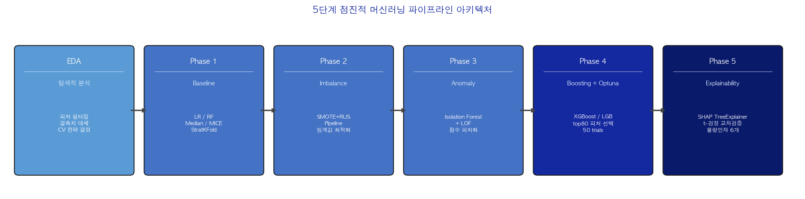
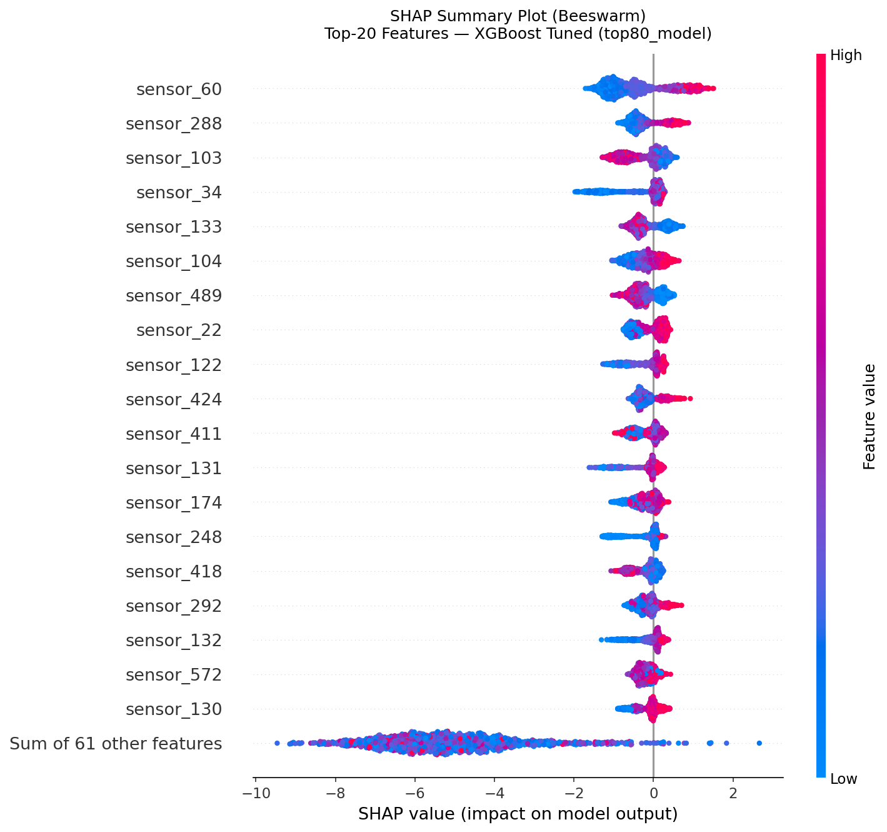

# Semiconductor Yield Prediction & Root-Cause Factor Identification

> 반도체 수율 **사전 예측** 및 **통계적 불량인자 규명** — UCI SECOM 데이터셋 기반 5단계 점진적 머신러닝 파이프라인

---

## Key Results

| Metric | Value |
|--------|-------|
| **Final PR-AUC** | 0.227 (XGBoost + Optuna, StratifiedKFold-5) |
| **Best Recall (Fail)** | 0.567 (Phase 2: SMOTE+RUS) |
| **High-Confidence Root Causes** | 6 sensors (SHAP ∩ t-test cross-validation) |
| **Estimated Business Impact** | ~$4.06M USD/year savings |
| **Dataset** | UCI SECOM — 1,567 samples × 590 features, 6.64% Fail |

---

## Tech Stack


---

## Project Overview

반도체 제조 공정에서 불량 웨이퍼를 **공정 완료 후 검사하는 것이 아니라**, 공정 도중 수집된 센서 데이터만으로 **사전에 예측**하여 하류 공정 낭비를 차단하는 것이 이 프로젝트의 핵심 목표입니다. 동시에 "어떤 공정 변수가 불량에 기여하는가"를 통계적·모델 기반 방법으로 정량화하여 공정 엔지니어가 실제로 활용 가능한 **근본 원인 인사이트**를 제공합니다.

UCI SECOM 데이터셋은 실제 반도체 제조 라인에서 수집된 공개 벤치마크로, 1,567개 샘플과 590개 익명화 센서 변수, 6.64%의 불량률(1:14.1 클래스 불균형)을 포함합니다. 고차원 소표본(p ≫ n), 극심한 클래스 불균형, 약한 신호 대 노이즈 비율이라는 세 가지 도전이 공존하며, 이는 현실 반도체 팹 환경을 그대로 반영합니다.

프로젝트는 EDA부터 SHAP 설명가능성까지 **5단계 점진적 파이프라인**으로 설계되어, 각 단계에서 추가되는 기술 요소의 성능 기여를 독립적으로 측정합니다. 데이터 누수 방지(`imblearn.Pipeline`), 시계열 CV 전략 실증 비교, SHAP × t-검정 교차검증을 통한 고신뢰 불량인자 도출이 핵심 방법론적 기여입니다.

---

## Pipeline Architecture



---

## Phase-by-Phase Results

| Phase | Configuration | PR-AUC | Recall (Fail) | Key Contribution |
|-------|--------------|--------|---------------|-----------------|
| Phase 1 | RF, no imbalance handling | 0.180 | 0.000 | Baseline — majority-class bias confirmed |
| Phase 2 | RF + SMOTE+RUS | 0.166 | **0.567** | Recall 0→0.567 via `imblearn.Pipeline` |
| Phase 3 | RF + SMOTE+RUS + Anomaly Scores | 0.180 | 0.346 | PR-AUC +0.014; IF+LOF feature augmentation |
| Phase 4 (default) | XGBoost + top80\_model features | 0.207 | 0.484 | Feature selection: single largest PR-AUC gain |
| **Phase 4 (tuned)** | **XGBoost + Optuna (50 trials)** | **0.227** | 0.558 | Best PR-AUC; +26.1% over Phase 3 |
| Phase 4 (tuned) | LightGBM + Optuna (50 trials) | 0.218 | 0.490 | Runner-up |
| Target | — | ≥ 0.40 | ≥ 0.70 | Not achieved (dataset signal ceiling) |

---

## Key Findings

- **sensor_60 dominates**: SHAP Mean|SHAP|=0.8105 (1.87× runner-up). Cohen's d=0.591로 통계적 검정에서도 최고 효과 크기 — 두 독립적 방법이 동일한 피처로 수렴.

- **Feature selection > everything else**: `all_446 → top80_model` 전환만으로 PR-AUC +0.028 달성 — 이상점수 피처화(+0.014)의 2배. 노이즈 피처 82% 제거가 가장 강력한 단일 개입.

- **Nonlinear interactions detected**: SHAP Top-20 중 14개(70%)가 단변량 t-검정에서 비유의(p > 0.05)한 SHAP-only 피처 — 단순 SPC 차트로 포착 불가능한 공정 변수 간 상호작용 효과가 존재함을 실증.

- **Business impact estimated at ~$4.06M USD/year**: 연간 12만 웨이퍼 생산, $2,000/wafer, Recall=0.567, 45% 비용 절감률 가정 기준. 선단 공정(3nm-5nm) 적용 시 $10.15M-$30.44M 규모.

---

## SHAP Analysis



*SHAP Beeswarm Plot — Top-20 features. sensor_60의 압도적 기여와 방향성(값이 높을수록 Fail 확률 상승)이 명확히 나타난다.*

---

## Technical Report

전체 실험 설계, 수식, 결과 분석, 한계 논의를 포함한 학술 형식 보고서:

**[📄 reports/technical_report.pdf](reports/technical_report.pdf)**

---

## Repository Structure

```
semiconductor-yield-prediction/
├── README.md
├── requirements.txt
├── .gitignore
├── scripts/
│   └── download_data.py          # Step 1: Download UCI SECOM dataset
├── notebooks/
│   ├── 01_eda/
│   │   └── eda_secom.py          # Exploratory data analysis
│   ├── phase1_baseline/
│   │   ├── 01_preprocess_compare.py
│   │   └── 02_baseline_models.py
│   ├── phase2_imbalance/
│   │   └── 01_imbalance_experiments.py
│   ├── phase3_unsupervised/
│   │   ├── 00_prelim_check.py
│   │   └── 01_anomaly_detection.py
│   ├── phase4_boosting/
│   │   └── 01_boosting_experiments.py
│   └── phase5_explainability/
│       └── 01_shap_analysis.py
├── src/
│   └── data/
│       └── preprocessing.py      # Shared preprocessing utilities
└── reports/
    ├── technical_report.pdf      # Full academic report
    ├── technical_report.md       # Report source
    ├── figures/                  # All generated visualizations (27 PNGs)
    ├── eda_findings.md
    ├── phase{1-5}_results.md     # Per-phase result summaries
    └── phase{1,2,4}_results_table.csv
```

> **Note**: `data/` is excluded from this repository. Raw data is publicly available from UCI and can be downloaded automatically (see Setup below).

---

## Setup & Reproduction

```bash
# 1. Clone the repository
git clone https://github.com/yhwang55/semiconductor-yield-prediction.git
cd semiconductor-yield-prediction

# 2. Install dependencies
pip install -r requirements.txt

# 3. Download UCI SECOM dataset
python scripts/download_data.py

# 4. Run the pipeline in order
python notebooks/01_eda/eda_secom.py
python notebooks/phase1_baseline/01_preprocess_compare.py
python notebooks/phase1_baseline/02_baseline_models.py
python notebooks/phase2_imbalance/01_imbalance_experiments.py
python notebooks/phase3_unsupervised/00_prelim_check.py
python notebooks/phase3_unsupervised/01_anomaly_detection.py
python notebooks/phase4_boosting/01_boosting_experiments.py
python notebooks/phase5_explainability/01_shap_analysis.py
```

All figures and result `.md` files are saved to `reports/` automatically.

---

## Author

**황윤 (Yoon Hwang)**
University of Wisconsin-Madison | Data Science & Economics & Information Science

- Email: yoondbs3@gmail.com
- GitHub: [github.com/yhwang55](https://github.com/yhwang55)
- LinkedIn: [linkedin.com/in/yoon-hwang](https://linkedin.com/in/yoon-hwang)
