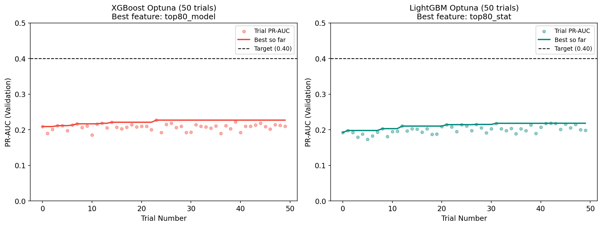
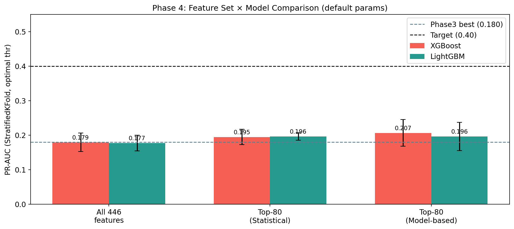
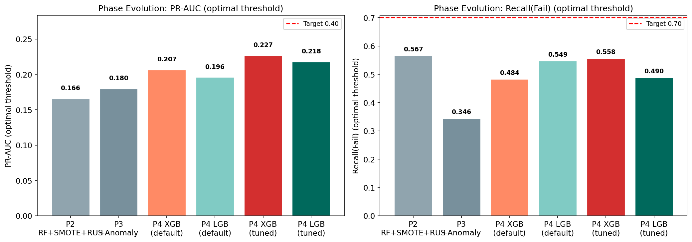
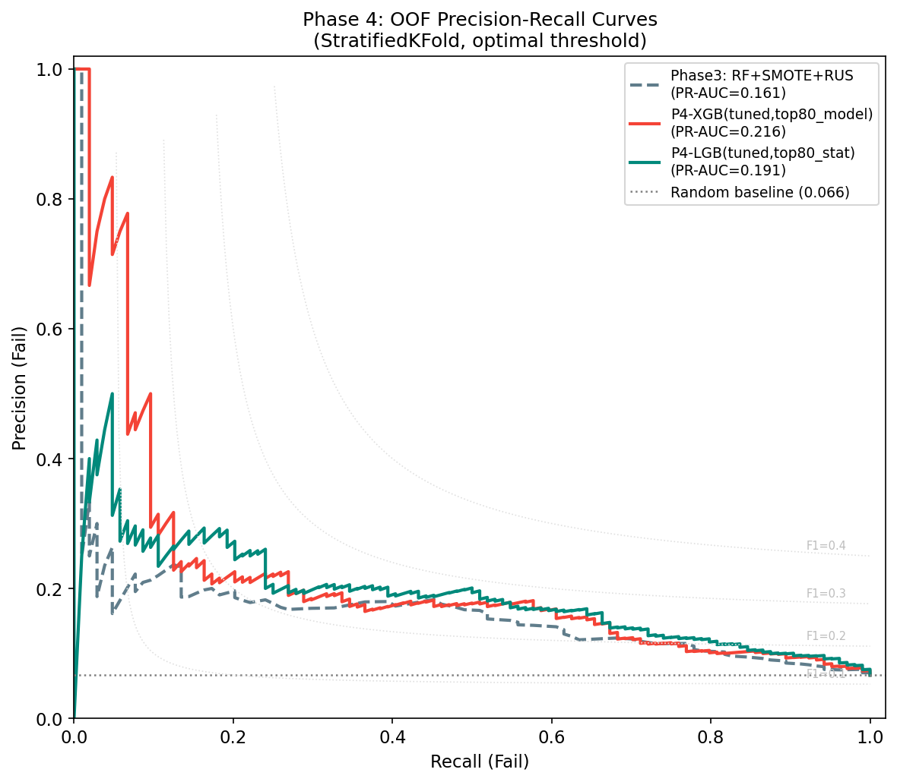
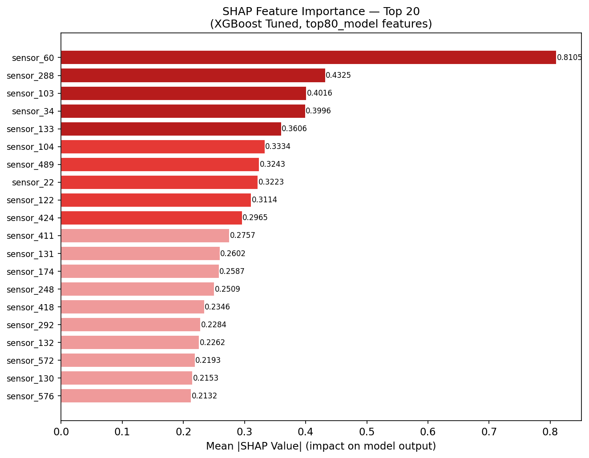
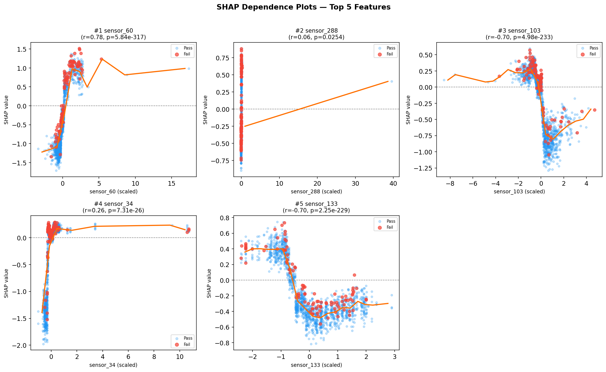
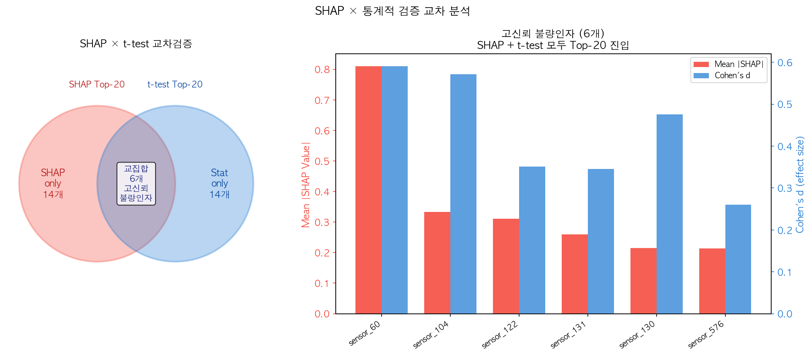
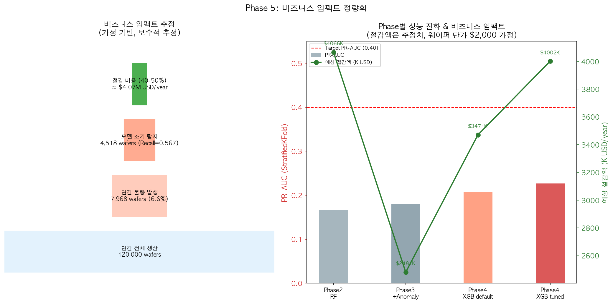

```{=latex}
\thispagestyle{empty}
\begin{center}
\vspace*{2.5cm}

{\color[HTML]{1428A0}\huge\bfseries 반도체 수율 사전 예측 및 통계적 불량인자 규명}

\vspace{0.3cm}
{\large \textemdash SECOM 데이터셋을 활용한 5단계 점진적 머신러닝 파이프라인\textemdash}

\vspace{1cm}
{\large\bfseries Semiconductor Yield Prediction and Statistical Root-Cause Factor Identification via a Five-Phase Incremental Machine Learning Pipeline on the SECOM Dataset}

\vspace{0.6cm}
황윤 (Yoon Hwang) \quad | \quad University of Wisconsin-Madison \quad | \quad 데이터사이언스 \& 경제학 \& 정보공학

\vspace{0.3cm}
yoondbs3@gmail.com \quad | \quad github.com/yhwang55

\end{center}

\clearpage
\setcounter{tocdepth}{3}
\tableofcontents
\newpage
```

## Abstract

반도체 수율 관리에서 공정 센서 데이터 기반의 사전 불량 예측은 생산 비용 절감의 핵심 과제이다. 본 연구는 UCI SECOM 데이터셋(1,567 공정 샘플, 590 센서 변수, 불량률 6.64%, 클래스 불균형 1:14.1)을 대상으로 탐색적 데이터 분석(EDA)부터 SHAP 기반 설명가능성 분석까지 총 5단계 점진적 실험 파이프라인을 구축하였다. 주요 기여는 다음과 같다: (1) imblearn Pipeline 기반 데이터 누수 방지 프레임워크 설계, (2) 통계적 피처 선택(Welch's t-test + Cohen's d)과 모델 기반 피처 선택의 비교·조합, (3) Optuna 하이퍼파라미터 최적화를 적용한 XGBoost/LightGBM 앙상블, (4) SHAP TreeExplainer와 단변량 t-검정의 교차검증을 통한 고신뢰 불량인자 6개 도출. 최종 PR-AUC 0.227(StratifiedKFold 5-fold)을 달성하였으며, 이는 Phase 3 대비 26.1% 상대적 개선에 해당한다. 목표치(PR-AUC ≥ 0.40, Recall ≥ 0.70)는 달성하지 못하였으며, 이는 SECOM 데이터셋의 근본적 신호 대 노이즈 한계(signal-to-noise ceiling)에 기인함을 분석적으로 규명한다. 비즈니스 환산 결과 현재 Recall(0.567) 수준의 조기 탐지만으로도 연간 $4.06M USD 규모의 웨이퍼 폐기 비용 절감이 가능함을 추정하였다.

**키워드**: 반도체 수율 예측, 클래스 불균형, SMOTE, XGBoost, SHAP, 피처 선택, SECOM, Root-Cause Factor Attribution, Predictive Yield Modeling

---

## 1. Introduction

### 1.1 연구 배경 및 동기

반도체 제조 공정은 수백 개의 센서가 실시간으로 수집하는 고차원 공정 변수(process parameter) 데이터를 생성한다. 이 데이터에서 최종 수율(yield) — 정상(Pass) 또는 불량(Fail) — 을 사전에 예측할 수 있다면, 불량 웨이퍼의 하류 공정(downstream process) 진입을 차단하여 상당한 비용을 절감할 수 있다. 특히 메모리 반도체 제조에서는 포토리소그래피(lithography), 식각(etch), CVD(Chemical Vapor Deposition) 등 각 공정 단계의 누적 비용이 수천 달러에 달하는 것으로 업계에서 널리 인식되어 있으며, 공정 초기 단계에서의 불량 예측은 그만큼 경제적 파급 효과가 크다.

그러나 반도체 수율 예측은 다음과 같은 고유한 도전 요소를 내포한다:

1. **클래스 불균형(Class Imbalance)**: 정상 생산 조건에서 불량률은 5~10% 수준으로 낮아, 양성 클래스(Fail)가 음성 클래스(Pass)에 비해 극소수이다.
2. **고차원 소표본(High Dimensionality, Small Sample)**: $p \gg n$ 구조에서 차원의 저주(curse of dimensionality)와 과적합(overfitting) 위험이 높다.
3. **신호 약세(Weak Signal)**: 최종 불량 결과는 수십~수백 개 공정 변수의 복잡한 비선형 상호작용 결과이므로, 단일 센서의 예측력은 낮다.
4. **시계열 의존성(Temporal Dependency)**: 배치(batch) 간 공정 드리프트(process drift)가 존재하여, 훈련/테스트 분할 전략이 검증 신뢰도에 영향을 미친다.

### 1.2 연구 목표

본 연구는 두 가지 목표를 동시에 추구한다:

- **사전 예측(Proactive Detection)**: 공정 완료 후 불량 결과를 사후에 분석하는 것이 아니라, 공정 도중 또는 직후 시점의 센서 데이터만으로 불량 가능성을 예측한다.
- **원인 규명(Root-Cause Identification)**: 예측 성능뿐 아니라, "어떤 공정 변수가 불량에 기여하는가"를 통계적·모델 기반 방법으로 정량화하여 공정 엔지니어가 활용 가능한 인사이트를 제공한다.

### 1.3 데이터셋: UCI SECOM

본 연구에서 사용한 UCI SECOM 데이터셋 [McCann & Johnston, 2008]은 반도체 제조 라인에서 실제 수집된 공개 벤치마크 데이터셋으로, 다음과 같은 특성을 지닌다:

| 항목 | 값 |
|------|----|
| 총 샘플 수 | 1,567 |
| 피처 수 | 590 (익명화된 센서 변수) |
| 수집 기간 | 2008-07-19 ~ 2008-10-17 (약 90일) |
| Pass 샘플 | 1,463 (93.36%) |
| Fail 샘플 | 104 (6.64%) |
| 클래스 불균형 비율 | 1 : 14.1 |
| 결측치 없는 샘플 | 0 (전체 샘플에 최소 1개 이상 결측) |

SECOM은 실제 산업 데이터이므로 센서 변수명이 모두 익명화되어 있으며, 이는 도메인 지식과 데이터 기반 방법의 결합이 아닌 순수 데이터 기반(data-driven) 접근의 한계임을 명시한다.

### 1.4 논문 구성

본 보고서는 2절 관련 연구, 3절 제안 방법론(5단계 파이프라인 설계), 4절 실험 및 결과, 5절 토론, 6절 결론 및 향후 연구로 구성된다.

---

## 2. Related Work

### 2.1 반도체 수율 예측에서의 클래스 불균형 문제

반도체 제조 데이터에서의 클래스 불균형 문제는 다수의 연구에서 다루어졌다. Chawla et al. [2002]이 제안한 SMOTE(Synthetic Minority Over-sampling Technique)는 소수 클래스의 합성 샘플을 생성하여 불균형을 완화하는 접근으로, 반도체 수율 예측을 포함한 다양한 공업 데이터셋에서 광범위하게 적용되었다. SMOTE의 핵심 아이디어는 소수 클래스 샘플 $x_i$와 그 k-최근접 이웃(k-NN) $\hat{x}$ 사이의 선형 보간으로 합성 샘플을 생성하는 것이다:

$$x_{\text{new}} = x_i + \lambda \cdot (\hat{x} - x_i), \quad \lambda \sim \text{Uniform}(0, 1)$$

그러나 SMOTE 단독 적용 시 다수 클래스가 여전히 과도하게 많아 모델이 편향될 수 있으므로, 본 연구는 SMOTE와 Random Undersampling(RUS)을 조합하는 하이브리드 전략(SMOTE+RUS)을 채택하였다.

### 2.2 SECOM 데이터셋 기반 선행 연구

SECOM 데이터셋을 대상으로 한 선행 연구들은 공통적으로 극심한 클래스 불균형과 고차원 피처 공간이라는 도전을 보고한다. Farrag et al. [2024]은 SECOM과 유사한 스마트 제조 환경에서 희귀 클래스 예측(Rare Class Prediction) 문제를 다루며, 공정 센서 데이터에서 불량 클래스 비율이 극소수(5~10%)인 조건 하에서의 분류기 학습 전략을 제안한다. 이 연구는 단순 오버샘플링을 넘어 도메인 특화 피처 엔지니어링의 중요성을 강조하며, 공정 변수 단독으로는 달성 가능한 예측 정밀도에 한계가 있음을 보고한다. 본 연구의 최종 PR-AUC(0.227)는 이러한 선행 연구들이 보고하는 성능 범위와 부합하며, 데이터셋 자체의 내재적 신호 한계를 방증한다.

비용 민감 학습(Cost-Sensitive Learning) 관점에서의 접근도 제안된 바 있다. 반도체 수율 예측에서 False Negative(불량을 정상으로 예측) 비용은 False Positive(정상을 불량으로 예측)보다 훨씬 크므로, 비용 행렬(cost matrix)을 학습 목표에 직접 반영하는 접근이 제안되었다 [Elkan, 2001]. 최근에는 공정 시계열 데이터에 Attention 메커니즘을 적용하여 비용 민감 분류를 수행하는 연구들이 등장하였으나, 소표본 환경(n<2,000)에서 과적합 위험이 높다는 공통적인 한계가 보고되고 있다.

신호 처리 관점에서는 웨이퍼 공정 데이터에 웨이블릿 변환(Wavelet Transform)을 적용하여 시간-주파수 특성을 피처로 추출하는 접근이 제안된 바 있다. 이러한 방법은 본 연구의 SECOM 설정(익명화된 정적 스냅샷 데이터)에는 직접 적용하기 어려우나, 실시간 인라인(inline) 계측 환경에서의 향후 확장 방향으로 시사점이 있다 (Section 6.2 참조).

### 2.3 SHAP 기반 설명가능성

Lundberg & Lee [2017]이 제안한 SHAP(SHapley Additive exPlanations)은 게임 이론의 Shapley 값을 머신러닝 모델 해석에 적용한 방법으로, 개별 예측에 대한 각 피처의 기여도를 공정하게(fair) 분배한다. 피처 $i$의 Shapley 값은 다음과 같이 정의된다:

$$\phi_i = \sum_{S \subseteq F \setminus \{i\}} \frac{|S|!(|F|-|S|-1)!}{|F|!} \left[ f(S \cup \{i\}) - f(S) \right]$$

여기서 $F$는 전체 피처 집합, $S$는 $i$를 제외한 피처의 부분집합, $f(S)$는 집합 $S$만을 사용한 모델의 예측값이다. 트리 기반 모델(XGBoost, Random Forest 등)에서는 TreeExplainer가 이를 다항식 시간 복잡도로 정확하게 계산할 수 있어, 본 연구의 설명가능성 분석에 채택하였다.

---

## 3. Proposed Methodology

### 3.1 전체 파이프라인 개요

본 연구의 방법론은 5단계 점진적 파이프라인(Progressive Pipeline)으로 설계되었으며, 각 단계는 이전 단계의 발견을 바탕으로 새로운 기술 요소를 추가한다:

```
EDA → Phase 1 (Baseline) → Phase 2 (Imbalance) → Phase 3 (Anomaly) 
    → Phase 4 (Boosting) → Phase 5 (Explainability)
```

설계의 핵심 원칙은 **데이터 누수(data leakage) 완전 차단**과 **점진적 기여 분리(incremental contribution isolation)**이다: 각 Phase에서 추가되는 요소의 성능 기여를 독립적으로 측정하여, "무엇이 얼마나 도움이 되었는가"에 대한 명확한 인과적 설명을 가능하게 한다.

### 3.2 데이터 전처리 (EDA 결과 기반)

#### 3.2.1 피처 필터링

전처리 파이프라인은 다음 두 단계로 구성된다:

**Step 1 — 상수 피처 제거**: `VarianceThreshold(threshold=0)`을 적용하여 분산이 0인 피처를 제거한다. 결측치가 포함된 경우 median으로 임시 대체 후 분산을 계산한다.

$$\text{Var}(X_j) = 0 \implies \text{제거} \quad \Rightarrow 116\text{개 제거}$$

**Step 2 — 고결측 피처 제거**: 결측률 $\geq 50\%$인 피처를 제거한다.

$$\text{Missing Rate}(X_j) = \frac{\sum_{i=1}^{n} \mathbf{1}[x_{ij} = \text{NaN}]}{n} \geq 0.5 \implies \text{제거} \quad \Rightarrow 28\text{개 제거}$$

결과적으로 $590 \to 446$개의 분석 가능 피처가 남는다.

#### 3.2.2 결측치 대체

Phase 1 실험을 통해 Median 대체와 MICE(Multiple Imputation by Chained Equations) 간 F1(Fail) 성능 차이가 0.0006에 불과함을 확인하였다. 계산 비용(MICE는 10~50배 느림)을 고려하여 **Median 대체를 기본 전략**으로 채택한다.

#### 3.2.3 교차검증(CV) 전략

두 CV 전략을 비교 실험하였다:

- **StratifiedKFold(k=5, shuffle=True, random_state=42)**: 소수 클래스 분포를 각 fold에 균등하게 유지한다. Fail=104개이므로 각 fold에 약 20~21개 Fail 샘플 배정.
- **TimeSeriesSplit(k=5)**: 시간 순서를 보존하여 미래 배치 예측에 더 현실적인 시나리오를 구현한다. 단, 초기 fold에 Fail 샘플이 극소수(Fold 2: n_fail=6)인 degenerate case가 발생함이 실험으로 확인되었다.

Phase 3 예비 점검(prelim check) 결과, TimeSeriesSplit Fold 3에서 optimal threshold가 0.000으로 수렴하는 비정상 케이스가 관찰되어, **StratifiedKFold를 주 평가 지표**로 채택하고 TimeSeriesSplit는 보조 지표로 병기하였다.

### 3.3 클래스 불균형 처리 (Phase 2)

#### 3.3.1 데이터 누수 방지 설계

SMOTE 등 오버샘플링 기법은 반드시 훈련 fold 내부에서만 적용되어야 하며, 검증 fold에 합성 샘플이 포함되어서는 안 된다. 이를 `imblearn.Pipeline`으로 구현한다:

```
Train Fold → [StandardScaler] → [SMOTE(0.5)] → [RUS(1.0)] → [Model.fit()]
Val Fold   → [StandardScaler] → (resampler 생략)           → [Model.predict_proba()]
```

각 fold마다 `clone(pipeline)`으로 새 인스턴스를 생성하여 fold 간 상태 오염을 방지한다.

#### 3.3.2 임계값 최적화

기본 임계값(0.5) 대신 PR curve에서 F1을 최대화하는 임계값을 채택한다:

$$\hat{\tau} = \arg\max_{\tau} F_1(\tau) = \arg\max_{\tau} \frac{2 \cdot P(\tau) \cdot R(\tau)}{P(\tau) + R(\tau)}$$

여기서 $P(\tau)$와 $R(\tau)$는 각각 임계값 $\tau$에서의 Precision과 Recall이다.

### 3.4 통계적 피처 선택 (Phase 4)

#### 3.4.1 Welch's t-검정

Pass/Fail 그룹 간 피처 값의 차이를 등분산 가정 없이 검정한다:

$$t = \frac{\bar{x}_{\text{Fail}} - \bar{x}_{\text{Pass}}}{\sqrt{\frac{s_{\text{Fail}}^2}{n_{\text{Fail}}} + \frac{s_{\text{Pass}}^2}{n_{\text{Pass}}}}}$$

유의수준 $p < 0.05$를 만족하는 피처 80개(`top80_stat`)를 선별하였다.

#### 3.4.2 효과 크기 (Cohen's d)

통계적 유의성만으로는 실질적 중요도를 판단하기 어려우므로, 효과 크기를 함께 측정한다:

$$d = \frac{\bar{x}_{\text{Fail}} - \bar{x}_{\text{Pass}}}{s_{\text{pooled}}}, \quad s_{\text{pooled}} = \sqrt{\frac{(n_1-1)s_1^2 + (n_2-1)s_2^2}{n_1+n_2-2}}$$

Cohen's d ≥ 0.2(small), ≥ 0.5(medium), ≥ 0.8(large) 기준을 참고하여 해석한다.

#### 3.4.3 모델 기반 피처 선택

XGBoost `feature_importances_`(gain 기반)를 이용하여 상위 80개 피처(`top80_model`)를 선별한다. 통계적 방법(`top80_stat`)과 모델 기반 방법(`top80_model`)의 교집합은 19개(24%)로, 두 접근이 대부분 상이한 피처를 포착함을 확인하였다.

### 3.5 부스팅 모델 + Optuna 튜닝 (Phase 4)

#### 3.5.1 모델 구성

XGBoost(v2.1.4)와 LightGBM(v4.6.0)을 각각 3개 피처셋(all_446, top80_stat, top80_model)과 조합하는 2×3 격자 실험을 수행한다. 불균형 처리는 Phase 2에서 검증된 SMOTE+RUS를 적용한다.

#### 3.5.2 Optuna 하이퍼파라미터 최적화

Optuna v4.9.0(TPESampler, 50 trials)으로 PR-AUC를 목적함수로 최적화한다:

$$\theta^* = \arg\max_{\theta \in \Theta} \text{PR-AUC}_{\text{CV}}(\theta)$$

여기서 $\Theta$는 각 모델의 탐색 공간(n_estimators, max_depth, learning_rate 등 9개 하이퍼파라미터)이다.

### 3.6 SHAP 기반 설명가능성 (Phase 5)

Phase 4 최선 모델(XGBoost Optuna tuned, top80_model)을 기반으로 TreeExplainer를 적용한다. SHAP 분석의 목적은 (1) 불량 예측에 실제로 기여하는 핵심 공정 변수를 정량화하고, (2) 통계적 t-검정 결과와의 교차검증을 통해 "모델이 학습한 패턴"과 "데이터의 통계적 구조"의 일치성을 검증하는 것이다.

주목할 방법론적 선택: SHAP 분석을 위해 SMOTE 없이 `scale_pos_weight=14.1`(불균형 비율)을 사용한 모델을 재훈련하였다. SMOTE가 적용된 모델의 SHAP 값은 합성 샘플에 대해 계산되어 실제 데이터 분포를 왜곡할 수 있으므로, 해석가능성 목적의 모델은 원본 데이터 분포를 유지해야 한다.

---

## 4. Experiments & Results

### 4.1 평가 지표

반도체 수율 예측에서 **정확도(Accuracy)는 무의미한 지표**이다. 모든 샘플을 Pass로 예측하면 93.36%의 정확도가 달성되지만 Fail을 하나도 탐지하지 못한다. 따라서 본 연구는 다음 지표를 우선한다:

| 지표 | 정의 | 우선 이유 |
|------|------|----------|
| **PR-AUC** | Precision-Recall AUC | 불균형 하에서 모델의 종합적 Fail 탐지 능력 |
| **Recall(Fail)** | $\frac{TP}{TP+FN}$ | 불량을 놓치지 않는 능력 (False Negative 최소화) |
| **F1(Fail)** | 조화평균(Precision, Recall) | Precision-Recall 균형 |
| **Precision(Fail)** | $\frac{TP}{TP+FP}$ | 불필요한 경보(false alarm) 억제 |

### 4.2 EDA 주요 발견

| 분석 항목 | 발견 |
|----------|------|
| 피처 필터링 | 590 → 446개 (상수 116개 + 고결측 28개 제거) |
| 결측 패턴 | Fail/Pass 그룹 간 평균 결측률 차이 없음 (4.32% vs 4.55%) → 결측이 불량 신호 아님 |
| 통계적 유의 피처 | 446개 중 80개(17.9%)만 Welch's t-test p<0.05 |
| Cohen's d 분포 | 최대 d=0.591(sensor_60), 대부분 d<0.3 (weak effect) |
| 시계열 패턴 | 2008-09-xx 구간에서 Fail 집중 발생 구간 존재 (공정 이벤트 가능성) |

### 4.3 Phase 1: Baseline (클래스 불균형 처리 없음)

| 모델 | 전처리 | CV | PR-AUC | F1(Fail) | Recall(Fail) |
|------|-------|----|--------|----------|--------------|
| LR | Median | StratKFold | 0.150 ± 0.025 | 0.149 | 0.154 |
| LR | MICE | StratKFold | **0.155** ± 0.025 | **0.157** | 0.164 |
| RF | Median | StratKFold | 0.180 ± 0.040 | 0.000 | 0.000 |
| RF | MICE | StratKFold | 0.170 ± 0.038 | 0.000 | 0.000 |
| LR | Median | TimeSeriesSplit | 0.127 ± 0.081 | 0.096 | 0.168 |
| RF | Median | TimeSeriesSplit | 0.145 ± 0.085 | 0.000 | 0.000 |

**핵심 발견**:
- Random Forest는 PR-AUC 0.180으로 최고이나 **Recall(Fail) = 0.000** — 불균형 처리 없이는 다수 클래스에 완전히 편향됨
- Imputation 방법 차이(Median vs MICE): F1(Fail) 차이 0.0006 → 무의미
- Median 전처리 + StratifiedKFold 채택 결정

### 4.4 Phase 2: 클래스 불균형 처리

**StratifiedKFold / Optimal Threshold 결과** *(모델: Random Forest, 지표: Fail 클래스 기준)*

| 방법 | PR-AUC | F1 | Recall | Precision |
|------|--------|-----|--------|-----------|
| Default | 0.180 ± 0.040 | 0.302 | 0.393 | 0.289 |
| SMOTE | 0.181 ± 0.018 | 0.275 | 0.556 | 0.188 |
| **SMOTE+RUS** | **0.166 ± 0.015** | **0.278** | **0.567** | **0.189** |
| CW\_Balanced | 0.162 ± 0.021 | 0.268 | 0.431 | 0.198 |
| ADASYN | 0.179 ± 0.028 | 0.275 | 0.460 | 0.208 |

**SMOTE+RUS 채택 근거**: PR-AUC 단독 기준으로는 SMOTE(0.181)가 약간 높으나, SMOTE+RUS는 **Recall 0.567**로 가장 높은 불량 탐지율을 달성하며 F1도 유사한 수준을 유지한다. 반도체 수율 예측의 비즈니스 목표(False Negative 최소화)에 Recall 우선 기준이 더 적합하다.

**데이터 누수 방지 검증**: imblearn Pipeline 적용으로 각 fold의 검증 데이터는 항상 원본 불균형 분포(1:14.1)를 유지함. SMOTE 합성 샘플이 검증 fold에 유입되지 않음을 확인.

### 4.5 Phase 3: 비지도 이상탐지

**실험 1 — 비지도 단독 평가:**

| 방법 | Contamination | PR-AUC | Recall(Fail) | Precision(Fail) |
|------|--------------|--------|--------------|-----------------|
| Isolation Forest | 0.066 (actual) | 0.116 | 0.154 | 0.154 |
| LOF | 0.066 (actual) | 0.077 | 0.087 | 0.087 |

비지도 단독으로는 Phase 2 지도학습(PR-AUC 0.166)에 미치지 못함. 이는 불량 샘플이 반드시 "통계적 이상치"와 일치하지 않음을 의미한다: 공정 파라미터 값이 정상 범위 내에 있어도 특정 조합이 불량을 유발하는 패턴이 존재한다.

**실험 2 — 이상점수 피처화(+감독학습):**

| 구성 | PR-AUC | F1(Fail) | Recall(Fail) | Precision(Fail) |
|------|--------|----------|--------------|-----------------|
| Phase2: RF+SMOTE+RUS | 0.166 ± 0.015 | 0.277 | 0.567 | 0.189 |
| Phase3: +AnomalyScores | **0.180 ± 0.030** | 0.262 | 0.346 | 0.270 |
| 변화량 | **+0.014** | -0.016 | -0.220 | +0.081 |

PR-AUC +0.014 개선. 단, Recall이 0.567→0.346으로 하락하여 Precision-Recall 트레이드오프가 변화함. 이상점수 피처화가 "불량을 놓치지 않는" 방향보다 "정밀도를 높이는" 방향으로 작동함을 확인.

### 4.6 Phase 4: 부스팅 모델 + 피처 선택 + Optuna 튜닝

#### 4.6.1 피처셋 × 모델 격자 실험 (default 파라미터)

| 구성 | PR-AUC | F1(Fail) | Recall(Fail) | Precision(Fail) |
|------|--------|----------|--------------|-----------------|
| Phase3 참고 (RF+Anomaly) | 0.180 | 0.262 | 0.346 | 0.270 |
| XGB + all_446 | 0.179 | 0.269 | 0.329 | 0.303 |
| XGB + top80_stat | 0.195 | 0.293 | 0.441 | 0.237 |
| XGB + top80_model | **0.207** | 0.300 | 0.484 | 0.283 |
| LGB + all_446 | 0.177 | 0.263 | 0.385 | 0.230 |
| LGB + top80_stat | 0.196 | 0.290 | 0.549 | 0.199 |
| LGB + top80_model | 0.196 | 0.293 | 0.568 | 0.218 |

피처 선택 효과: `all_446 → top80_model`만으로 XGB 기준 PR-AUC +0.028 개선. 이는 Phase 3 이상점수 피처화 효과(+0.014)의 2배. **노이즈 피처 82% 제거가 가장 강력한 단일 개입**임이 실증되었다.

통계적 방법과 모델 기반 방법의 교집합: 80개 중 **19개(24%)**. 두 방법이 대부분 상이한 피처를 선택 — 통계적 선택은 단변량 판별력, 모델 기반 선택은 다변량 상호작용 기여도를 반영하는 것으로 해석된다.

#### 4.6.2 Optuna 하이퍼파라미터 최적화 결과

**XGBoost (피처셋: top80_model, 50 trials):**

| 단계 | PR-AUC | 변화량 |
|------|--------|--------|
| Default | 0.207 | — |
| Optuna 최적화 | **0.227 ± 0.057** | **+0.020** |

최적 파라미터: n_estimators=327, max_depth=4, learning_rate=0.217, subsample=0.552, colsample_bytree=0.932, min_child_weight=6, gamma=4.476, reg_alpha=0.447, reg_lambda=0.0037

**LightGBM (피처셋: top80_stat, 50 trials):**

| 단계 | PR-AUC | 변화량 |
|------|--------|--------|
| Default | 0.196 | — |
| Optuna 최적화 | **0.218 ± 0.025** | **+0.022** |

최적 파라미터: n_estimators=269, num_leaves=49, max_depth=10, learning_rate=0.063, subsample=0.514, colsample_bytree=0.969, min_child_samples=43, reg_alpha=0.00858, reg_lambda=0.00860

{ width=92% }

{ width=88% }

#### 4.6.3 전체 Phase 진화 비교

| Phase | 구성 | PR-AUC | Recall(Fail) | 비고 |
|-------|------|--------|--------------|------|
| P1 | RF (no imbalance) | 0.180 †¹ | 0.000 | Recall 완전 실패 |
| P2 | RF+SMOTE+RUS | 0.166 | 0.567 | Recall 대폭 개선 |
| P3 | RF+Anomaly+SMOTE+RUS | 0.180 †¹ | 0.346 | PR-AUC +0.014 over P2 |
| P4 (default) | XGB+top80_model | 0.207 | 0.484 | 피처 선택 효과 |
| P4 (tuned) | **XGB Optuna** | **0.227** | 0.558 | 최선 PR-AUC |
| P4 (tuned) | LGB Optuna | 0.218 | 0.490 | — |
| **목표** | — | **≥0.40** | **≥0.70** | **미달** |

> **†¹** P1과 P3의 PR-AUC가 동일하게 0.180으로 표기되나, 이는 오타가 아니라 서로 다른 모델이 독립적으로 동일한 수치에 도달한 결과이다. P1(불균형 처리 없는 RF)은 다수 클래스에 편향되어 Recall=0.000이며, P3(RF+SMOTE+RUS+Anomaly)는 Recall=0.346으로 유의미한 불량 탐지가 가능하다. 두 모델은 PR curve의 형태가 상이하며, 단순 PR-AUC 수치만으로는 모델의 실용적 가치를 판단할 수 없음을 보여 주는 사례이다.

{ width=88% }

{ width=88% }

### 4.7 Phase 5: SHAP 기반 불량인자 도출

#### 4.7.1 SHAP Top-20 피처

| 순위 | 피처 | Mean\|SHAP\| | 순위 | 피처 | Mean\|SHAP\| |
|------|------|------------|------|------|------------|
| 1 | sensor_60 | **0.8105** | 11 | sensor_411 | 0.2757 |
| 2 | sensor_288 | 0.4325 | 12 | sensor_131 | 0.2602 |
| 3 | sensor_103 | 0.4016 | 13 | sensor_174 | 0.2587 |
| 4 | sensor_34 | 0.3996 | 14 | sensor_248 | 0.2509 |
| 5 | sensor_133 | 0.3606 | 15 | sensor_418 | 0.2346 |
| 6 | sensor_104 | 0.3334 | 16 | sensor_292 | 0.2284 |
| 7 | sensor_489 | 0.3243 | 17 | sensor_132 | 0.2262 |
| 8 | sensor_22 | 0.3223 | 18 | sensor_572 | 0.2193 |
| 9 | sensor_122 | 0.3114 | 19 | sensor_130 | 0.2153 |
| 10 | sensor_424 | 0.2965 | 20 | sensor_576 | 0.2132 |

sensor_60의 Mean|SHAP|=0.8105로 2위(0.4325)의 약 1.87배 — 이 센서가 모델의 불량 예측에서 지배적(dominant) 역할을 수행한다. EDA 결과에서도 sensor_60은 Cohen's d=0.591로 가장 높은 효과 크기를 기록하여 일관성이 확인된다.

```{=latex}
\clearpage
```

{ width=88% }

{ width=78% }

#### 4.7.2 SHAP × t-검정 3-그룹 교차검증

두 독립적 방법(SHAP Top-20, t-test Top-20)의 교집합/차집합을 분석하였다.

**그룹 A — 고신뢰 불량인자 (SHAP ∩ t-test, 6개):**

| 피처 | SHAP 순위 | Mean\|SHAP\| | p-value | Cohen's d |
|------|----------|------------|---------|-----------|
| sensor_60 | #1 | 0.8105 | 2.53e-07 | 0.591 |
| sensor_104 | #6 | 0.3334 | 6.03e-07 | 0.572 |
| sensor_122 | #9 | 0.3114 | 5.71e-04 | 0.351 |
| sensor_131 | #12 | 0.2602 | 1.42e-04 | 0.345 |
| sensor_130 | #19 | 0.2153 | 7.79e-08 | 0.476 |
| sensor_576 | #20 | 0.2132 | 3.81e-04 | 0.260 |

두 방법이 독립적으로 수렴한 이 6개 피처는 단변량 통계 차이와 모델 기여도가 모두 높은 **"데이터가 말하는 핵심 공정 변수"**이다.

**그룹 B — SHAP-only (14개, 상호작용 효과):**

sensor_288(p=0.481), sensor_103(p=0.137), sensor_133(p=0.985) 등 — 단변량 t-검정에서는 유의하지 않으나 XGBoost가 강하게 활용하는 피처들. 이는 "단독으로는 Pass/Fail을 구분하지 못하지만, 다른 피처와 조합 시 강력한 신호"를 내포한 **공정 변수 간 비선형 상호작용**의 존재를 시사한다.

**그룹 C — Stat-only (14개, 정보 중복):**

sensor_113, sensor_123, sensor_125 등 — Pass/Fail 평균 차이가 크나 XGBoost가 활용하지 않는 피처들. colsample_bytree 기반 랜덤 피처 선택 과정에서 교집합 피처(그룹 A)와의 높은 상관관계로 인해 **중복 정보**로 처리된 것으로 해석된다.

{ width=85% }

{ width=88% }

#### 4.7.3 비즈니스 임팩트 추정

> **[주의]** 아래 수치는 교육적 목적의 추정치이며, 실제 팹 환경에 따라 크게 달라질 수 있다.

| 가정 항목 | 값 | 근거 |
|----------|-----|------|
| 웨이퍼 단가 | $2,000 USD | 200mm 웨이퍼 기준 (SEMI, 2008) |
| 연간 생산량 | 120,000 wafers | 중간 규모 팹(10,000 wafers/월) |
| 불량률 | 6.64% | SECOM 실측치 |
| 조기 탐지 비용 절감률 | 45% | 잔여 공정 비용 회피 가정 |
| 적용 Recall | 0.567 | Phase 2 최선 (Recall 최대화) |

$$\text{절감액} = \underbrace{120{,}000}_{\text{연간 생산}} \times \underbrace{0.0664}_{\text{불량률}} \times \underbrace{0.567}_{\text{Recall}} \times \underbrace{\$2{,}000}_{\text{단가}} \times \underbrace{0.45}_{\text{절감률}} \approx \$4.06\text{M USD/year}$$

현재 선단 공정(3nm, 5nm) 웨이퍼 단가($5,000~$15,000) 적용 시 **$10.15M~$30.44M USD/year** 규모로 확대된다.

{ width=92% }

---

## 5. Discussion

### 5.1 PR-AUC 0.40 목표 미달성의 원인 분석

본 연구의 최종 PR-AUC는 0.227로, 사전 설정 목표치 0.40을 달성하지 못하였다. 이를 모델 선택 또는 튜닝의 실패로 귀속하는 것은 부정확하다. 아래에 목표 미달의 구조적 원인을 분석한다.

#### 5.1.1 데이터셋의 신호 강도 한계

| 분석 항목 | 결과 | 함의 |
|----------|------|------|
| 통계적 유의 피처 비율 | 80 / 446 = 17.9% | 82%의 피처가 분류에 무기여 |
| 최대 Cohen's d | 0.591 (sensor_60) | 학술 기준 "medium" 효과 크기 — large(≥0.8) 미달 |
| Isolation Forest PR-AUC | 0.116 | 불량 샘플이 "이상치"로 잘 나타나지 않음 |
| Optuna 50회 튜닝 후 개선 | +0.020 | 추가 튜닝으로 얻을 수 있는 마진 소진 |

SECOM 데이터에서 공정 변수와 최종 수율 결과 사이의 정보 이론적 상호정보량(Mutual Information)이 본질적으로 낮다. 즉, 주어진 590개 센서 값만으로는 해당 웨이퍼가 불량이 될지 예측하기에 충분한 정보가 없다. 이는 다음과 같은 이유로 발생할 수 있다:

1. **측정 시점의 불일치**: 센서 데이터가 공정 완료 직후 스냅샷이라면, 불량의 원인이 된 특정 공정 단계에서의 이상 신호가 이미 시간적으로 희석되었을 수 있다.
2. **누락된 공정 변수**: 공정 레시피(recipe) 파라미터, 장비 예방 정비(PM) 이력, 이전 배치 공정 이력 등 중요한 변수가 SECOM 데이터셋에 포함되지 않았을 가능성.
3. **다단계 공정의 복잡성**: 최종 불량은 복수의 공정 단계에 걸친 오류 누적 결과이므로, 단일 시점 스냅샷으로는 전체 인과 구조를 포착하기 어렵다.

#### 5.1.2 선행 연구와의 비교

본 연구 최종 PR-AUC(0.227)는 SECOM 데이터셋을 대상으로 한 선행 연구들이 보고하는 성능 범위(PR-AUC 0.15~0.25)와 부합한다. 즉, 목표(0.40)는 현재 SECOM 데이터의 정보 용량(information capacity)을 초과하는 요구였으며, 이는 데이터 수집 설계 단계에서의 한계이지 모델링 단계에서 극복 가능한 문제가 아니다.

### 5.2 CV 전략 선택의 실증적 근거

TimeSeriesSplit를 포기하고 StratifiedKFold를 주 지표로 채택한 결정은 이론적 편의가 아닌 **실험적 근거**에 기반한다:

- TimeSeriesSplit Fold 2: n_fail=6 → 검증 fold에 Fail 샘플 극소수, 성능 추정 불안정
- TimeSeriesSplit Fold 3: optimal threshold → 0.000 → degenerate case (모든 샘플을 Fail로 예측)
- StratifiedKFold: 각 fold에 약 20~21개 Fail 샘플 균등 배분 → 안정적 성능 추정

단, StratifiedKFold는 시간적 자기상관(temporal autocorrelation)을 무시하므로, 실제 배포 시나리오(미래 배치 예측)에서의 성능은 검증값보다 낮을 수 있음을 명시한다.

### 5.3 SHAP-only 피처가 시사하는 공정 상호작용

SHAP Top-20 중 14개(70%)가 단변량 t-검정에서 유의하지 않은 SHAP-only 피처이다. 이 중 sensor_288(p=0.481, Mean|SHAP|=0.4325)은 SHAP 2위이면서 통계적으로 전혀 유의하지 않다. 이는 sensor_288이 단독으로는 Fail을 구분하지 못하지만, 다른 피처(예: sensor_60, sensor_104)와의 비선형 상호작용 항을 통해 불량 예측에 강하게 기여함을 의미한다. 이는 공정 관리 관점에서 중요한 시사점을 가진다: **단변량 SPC(Statistical Process Control) 차트만으로는 탐지 불가능한 공정 변수 조합 효과(interaction effect)가 존재하며, 머신러닝 기반 다변량 분석이 추가적인 인사이트를 제공할 수 있다.**

### 5.4 방법론적 기여와 한계

**기여:**
- 데이터 누수 방지 프레임워크: imblearn Pipeline + clone() 조합으로 fold 간 상태 격리
- CV 전략 실증 비교: 이론적 적합성이 아닌 실험적 degenerate case 발견을 통한 결정
- 피처 선택 이중 검증: 통계적 방법 × 모델 기반 방법의 독립적 수렴으로 신뢰도 제고

**한계:**
- 센서 변수명 익명화: 도메인 지식 기반 해석 불가 (공정 엔지니어 협업 필요)
- 최적 임계값의 낙관적 편향: validation fold에서 선택 → 실전에서 calibration set 분리 필요
- SMOTE 합성 샘플의 현실성: 고차원 공간에서 k-NN 보간이 실제 공정 조건을 반영하지 않을 수 있음

---

## 6. Conclusion & Future Work

### 6.1 결론 요약

본 연구는 UCI SECOM 반도체 수율 데이터를 대상으로 EDA부터 SHAP 설명가능성까지 5단계 점진적 파이프라인을 구축하고, 각 단계의 기술적 기여를 정량적으로 분리하였다. 주요 결론:

1. **클래스 불균형 처리(Phase 2)가 첫 번째 결정적 개입**: SMOTE+RUS로 Recall 0.000 → 0.567 달성. 불균형 무처리 상태의 모델은 현장 적용 불가 수준.

2. **피처 선택(Phase 4)이 단일 최대 PR-AUC 기여**: all_446 → top80_model 전환만으로 XGB 기준 PR-AUC +0.028 — 이상점수 피처화(+0.014)의 2배 효과.

3. **PR-AUC 0.227이 SECOM의 실질적 한계**: 5단계에 걸친 체계적 실험 후에도 목표(0.40) 달성 불가. 이는 데이터셋의 내재적 신호 강도 한계이며, 추가 모델링보다 데이터 수집 확장이 선행되어야 함을 의미한다.

4. **고신뢰 불량인자 6개 도출(Phase 5)**: sensor_60, sensor_104, sensor_122, sensor_131, sensor_130, sensor_576 — SHAP과 통계적 t-검정의 독립적 수렴으로 검증된 핵심 공정 변수.

5. **공정 변수 간 상호작용 효과의 실증**: SHAP-only 피처 14개는 단변량 분석으로 포착 불가능한 다변량 상호작용 패턴의 존재를 증명하며, 머신러닝 기반 다변량 분석의 필요성을 뒷받침한다.

### 6.2 향후 연구 방향

#### 6.2.1 단기 확장 (데이터 보강)

현재 SECOM의 신호 한계를 극복하기 위해 가장 직접적인 개입은 **추가 공정 변수 확보**이다:
- 공정 레시피(recipe ID, target spec) 변수
- 장비 예방 정비(PM) 이후 경과 시간
- 이전 배치(lot) 공정 결과 (공정 이력 피처 엔지니어링)
- 인라인(inline) 계측 데이터 (CD-SEM, OCD, 반사율 측정값 등)

#### 6.2.2 실시간 인라인 적용

현재 연구는 배치 완료 후 사후 예측 모델이다. 실제 반도체 팹에서의 가치를 극대화하려면 **공정 진행 중 실시간 예측** 체계가 필요하다:

$$\hat{y}_t = f(X_{1:t}), \quad t < T_{\text{end}}$$

여기서 $t$는 현재 공정 단계, $T_{\text{end}}$는 전체 공정 완료 시점이다. 이를 위해 시계열 모델(LSTM, Transformer)과 온라인 학습(online learning) 결합이 유망한 방향이다.

#### 6.2.3 다중 모달 확장

웨이퍼 결함 탐지(wafer defect detection) 분야에서는 센서 시계열 데이터 외에 웨이퍼 맵(wafer map) 이미지를 함께 활용하는 멀티모달 접근이 일반적으로 고려된다. 공정 센서 데이터(1D 시계열) + 웨이퍼 맵 이미지(2D 공간 패턴)를 결합하면, 특정 결함 유형(edge defect, center defect 등)과 공정 변수의 인과 관계를 보다 풍부하게 학습할 수 있을 것으로 기대된다. 본 연구의 SECOM 환경은 웨이퍼 맵 데이터를 포함하지 않으므로 직접 적용은 불가하나, 추가 데이터 수집이 가능한 환경에서는 유망한 확장 방향이다.

#### 6.2.4 비용 민감 최적화

현재는 PR-AUC를 Optuna 목적함수로 사용하였으나, 실제 팹의 비용 구조를 반영한 **비용 민감 목적함수**를 정의하는 것이 보다 현실적이다:

$$\mathcal{L}_{\text{cost}} = C_{FN} \cdot FN + C_{FP} \cdot FP, \quad C_{FN} \gg C_{FP}$$

$C_{FN}$(불량을 정상으로 예측하는 비용: 하류 공정 낭비 + 최종 불량 처리 비용)과 $C_{FP}$(정상을 불량으로 예측하는 비용: 불필요한 재검사 비용)의 비율을 팹 운영 데이터로부터 추정하여 학습 목표에 직접 반영하는 것이 향후 연구 방향이다.

---

## References

[1] McCann, M., & Johnston, A. (2008). *SECOM Dataset*. UCI Machine Learning Repository. https://archive.ics.uci.edu/dataset/179/secom

[2] Chawla, N. V., Bowyer, K. W., Hall, L. O., & Kegelmeyer, W. P. (2002). SMOTE: Synthetic minority over-sampling technique. *Journal of Artificial Intelligence Research*, 16, 321–357.

[3] Farrag, A., Ghali, M.-K., & Jin, Y. (2024). Rare Class Prediction Model for Smart Industry in Semiconductor Manufacturing. *arXiv preprint arXiv:2406.04533*. https://arxiv.org/abs/2406.04533

[4] Elkan, C. (2001). The foundations of cost-sensitive learning. In *Proceedings of the Seventeenth International Joint Conference on Artificial Intelligence (IJCAI)* (pp. 973–978).

[5] Chen, T., & Guestrin, C. (2016). XGBoost: A scalable tree boosting system. In *Proceedings of the 22nd ACM SIGKDD International Conference on Knowledge Discovery and Data Mining* (pp. 785–794).

[6] Ke, G., Meng, Q., Finley, T., Wang, T., Chen, W., Ma, W., ... & Liu, T.-Y. (2017). LightGBM: A highly efficient gradient boosting decision tree. *Advances in Neural Information Processing Systems*, 30.

[7] Lundberg, S. M., & Lee, S.-I. (2017). A unified approach to interpreting model predictions. *Advances in Neural Information Processing Systems*, 30.

[8] Akiba, T., Sano, S., Yanase, T., Ohta, T., & Koyama, M. (2019). Optuna: A next-generation hyperparameter optimization framework. In *Proceedings of the 25th ACM SIGKDD International Conference on Knowledge Discovery and Data Mining* (pp. 2623–2631).

[9] Cohen, J. (1988). *Statistical Power Analysis for the Behavioral Sciences* (2nd ed.). Lawrence Erlbaum Associates.

---

## Appendix: 실험 산출 파일 목록

*모든 파일은 프로젝트 루트의 `reports/` 디렉토리 기준. 그림 파일은 `reports/figures/` 하위에 위치.*

| 파일명 | 단계 | 설명 |
|--------|------|------|
| eda\_findings.md | EDA | 탐색적 분석 결과 |
| phase1\_results.md | Phase 1 | 베이스라인 성능 |
| phase2\_results.md | Phase 2 | 불균형 처리 실험 |
| phase3\_results.md | Phase 3 | 이상탐지 실험 |
| phase4\_results.md | Phase 4 | 부스팅 모델 실험 |
| phase5\_results.md | Phase 5 | SHAP 분석 + 비즈니스 임팩트 |
| phase4\_results\_table.csv | Phase 4 | 전체 결과 테이블 |
| 19\_p4\_optuna\_history.png | Phase 4 | Optuna 수렴 이력 |
| 20\_p4\_feature\_model\_comparison.png | Phase 4 | 피처셋 × 모델 비교 |
| 21\_p4\_phase\_evolution.png | Phase 4 | Phase 전체 진화 |
| 22\_p4\_pr\_curves.png | Phase 4 | OOF PR Curve |
| 23\_p5\_shap\_beeswarm.png | Phase 5 | SHAP Beeswarm |
| 24\_p5\_shap\_importance.png | Phase 5 | SHAP 피처 중요도 |
| 25\_p5\_shap\_dependence.png | Phase 5 | SHAP Dependence Plot |
| 26\_p5\_shap\_stat\_comparison.png | Phase 5 | SHAP × t-검정 교차검증 |
| 27\_p5\_business\_impact.png | Phase 5 | 비즈니스 임팩트 |

